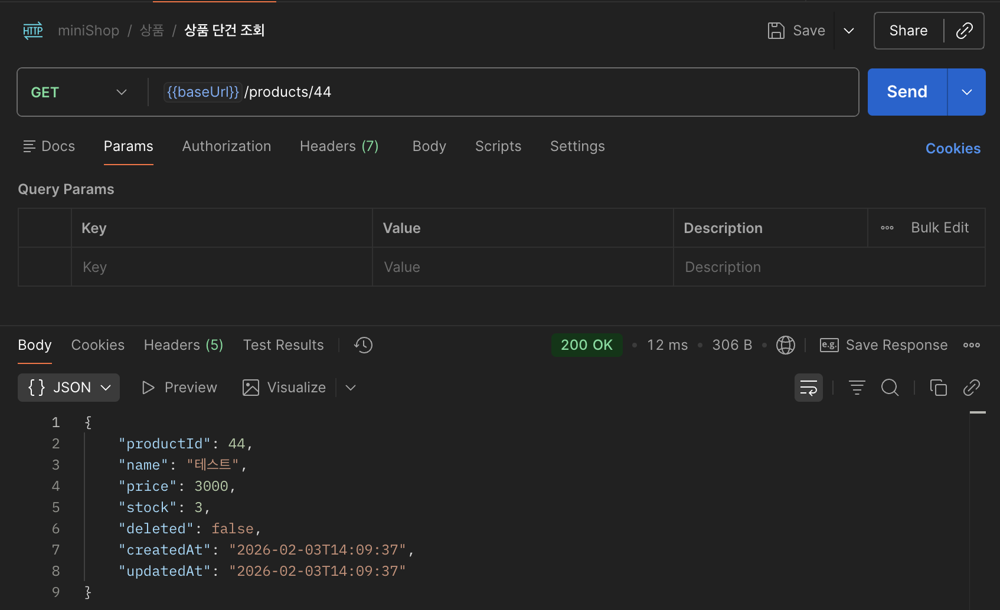
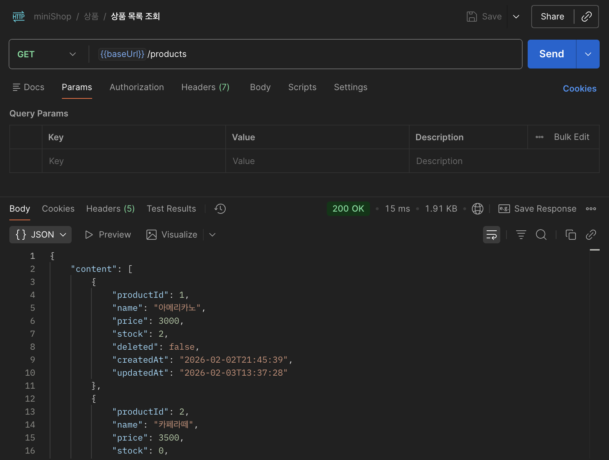
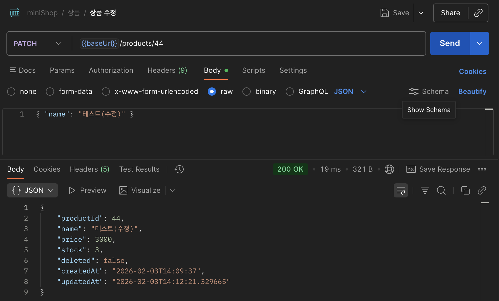
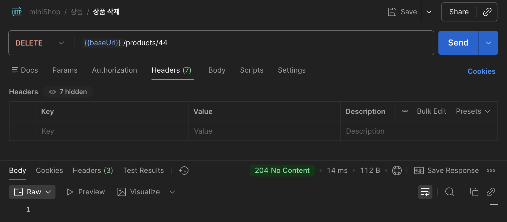
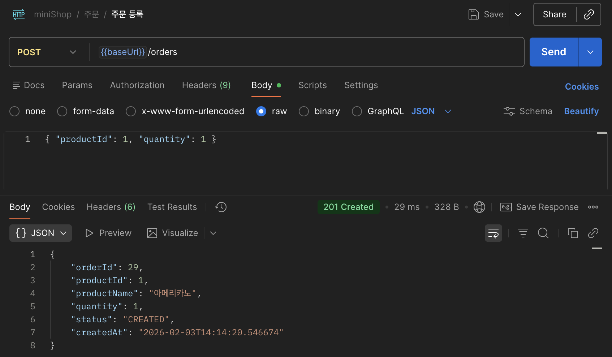
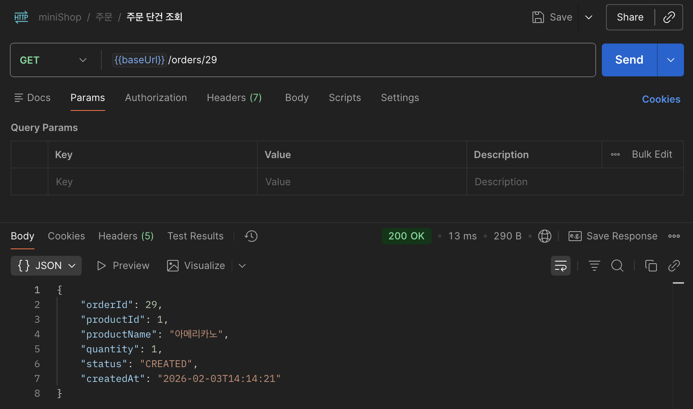
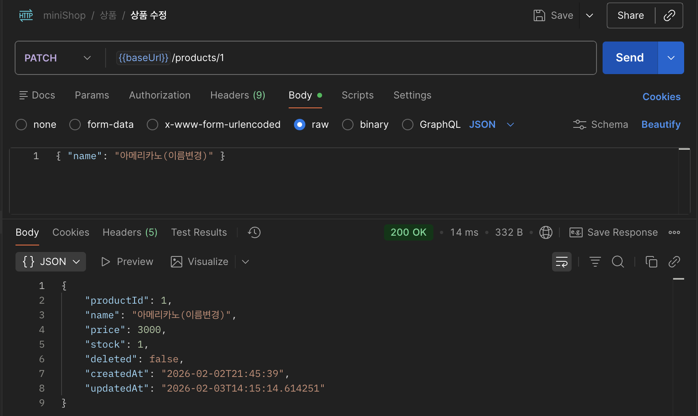
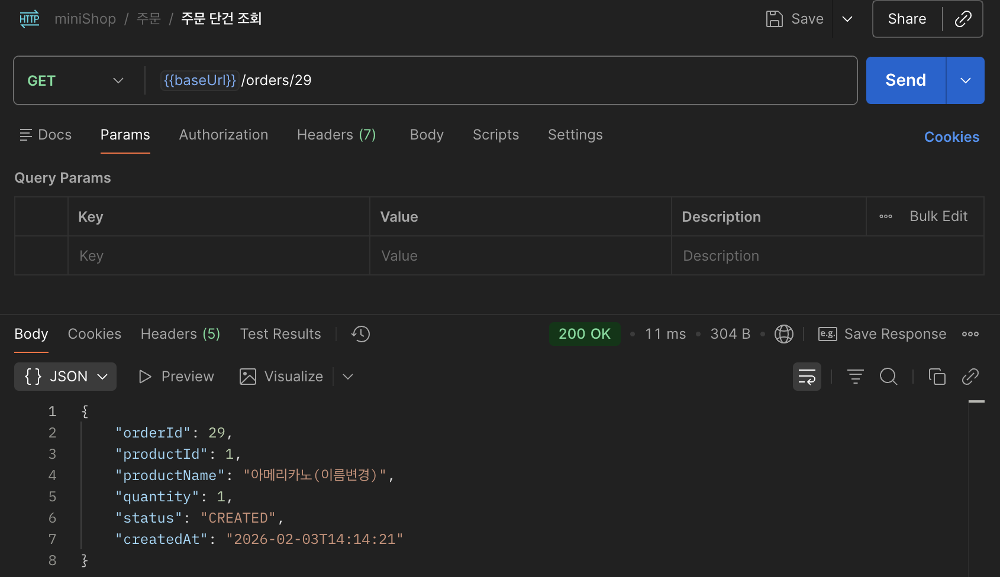
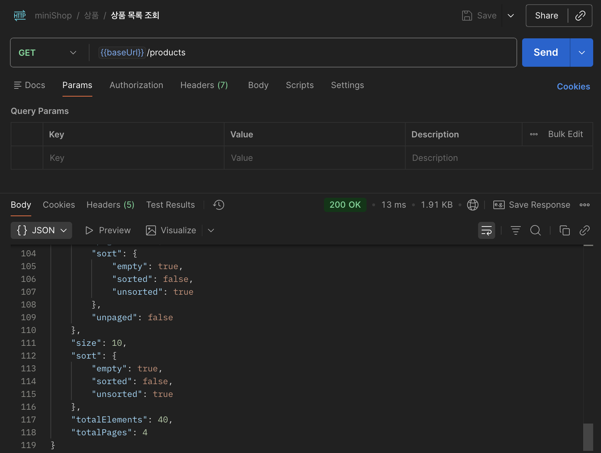
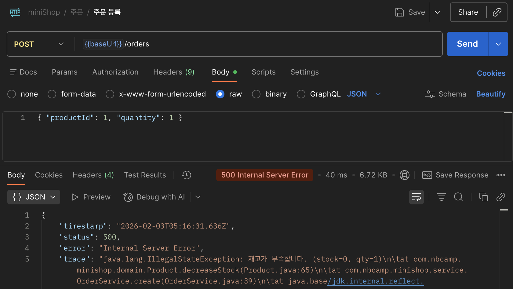

# MiniShop (Backend)

MiniShop은 **상품 등록/조회/수정/삭제(Soft Delete)** 및 **주문 생성/조회/취소** 기능을 제공하는 미니 쇼핑몰 프로젝트.

간단한 Spring CRUD 복습

---

## MiniShop 프론트엔드 레포지토리

- 프론트엔드(React/Vite): https://github.com/M1Nj1M/miniShop_front

---

## 백엔드 프로젝트 구조

```text
src/main/java/com/nbcamp/minishop
├─ controller
│  ├─ OrderController
│  └─ ProductController
│
├─ service
│  ├─ OrderService
│  └─ ProductService
│
├─ repository
│  ├─ OrderRepository
│  └─ ProductRepository
│
├─ domain
│  ├─ Order
│  ├─ Product
│  └─ OrderStatus
│
└─ dto
   ├─ order
   │  └─ OrderResponse
   │
   └─ product
      └─ ProductResponse
```

---

## API 테스트 검증 (Postman)

### 1. 상품 등록

- 상품을 신규로 등록합니다.


---

### 2. 상품 단건 조회

- 등록된 상품을 ID 기준으로 조회합니다.



---

### 3. 상품 목록 조회

- 전체 상품 목록을 조회합니다.



---

### 4. 상품 수정

- 상품의 이름 및 정보를 수정합니다.



---

### 5. 상품 삭제 (Soft Delete)

- 상품을 논리적으로 삭제 처리합니다.



---

### 6. 주문 생성

- 이미 등록된 상품 ID를 이용해 주문을 생성합니다.



---

### 7. 주문 단건 조회 (상품명 포함)

- 주문 조회 시 연관된 상품의 이름이 함께 노출됩니다.



---

### 8. 상품명 변경 후 주문 조회 반영 확인

- 상품 이름을 수정한 뒤, 기존 주문을 다시 조회했을 때  
  변경된 상품명이 주문 조회 결과에 반영되는지 확인합니다.

#### 8-1. 상품 이름 변경



#### 8-2. 주문 조회 결과 반영 확인



---

### 9. 주문 목록 조회 (페이지네이션)

- 여러 주문을 페이지 단위로 조회하며,  
  각 주문에는 상품명이 포함됩니다.



> 💡 주문 목록 조회 시 Fetch Join을 사용하여  
> 주문과 상품을 한 번에 조회함으로써 N+1 문제를 방지했습니다.

---

### 10. 재고 차감 및 원자성 검증

- 재고가 1인 상품에 대해 주문을 2번 시도한 결과입니다.
- 1회차 주문은 성공하고, 2회차 주문은 재고 부족으로 실패합니다.



> 💡 재고 차감 시 `stock >= 1` 조건을 포함한 단일 UPDATE 쿼리를 사용하여  
> 동시 요청 상황에서도 원자성을 보장했습니다.

---
